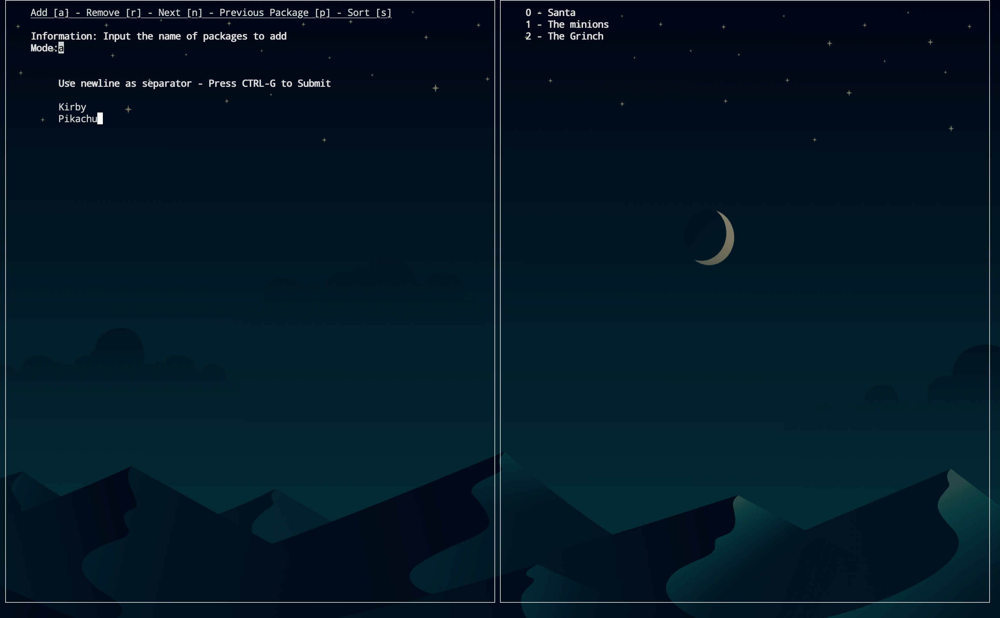
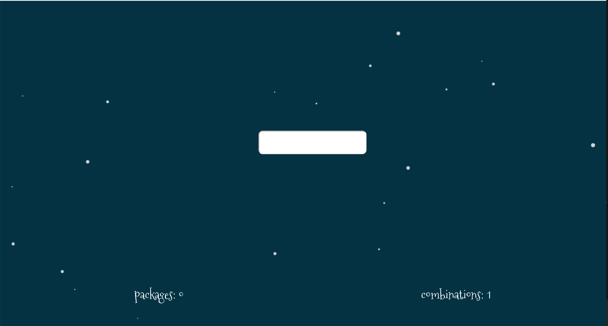

Xmas Game 
---


GUI
---




Interface
---




## Install & Run

Install requirements and setup docker with the following command:
```bash
> source setup
```

Start the sockets & GUI with the following command:
``` bash
> ./xmas
```

# Known Errors
  * Will crash on small screens because curses can't find space to render all the text
