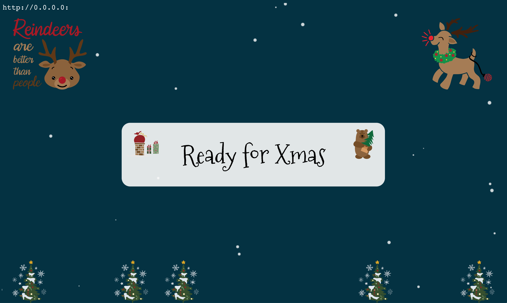

Xmas Game 
---




GUI
---


Interface
---


## Install
```bash
pip3 install -r requirements.txt
```

## Play
Start server from webb/ with
```bash
python3 -m http.server --bind "0.0.0.0" 80
```

Start Socket and GUI with
```bash
python3 xmas.py
```

# Known Errors
  * Will crash on small screens because curses can't find space to render all the text
